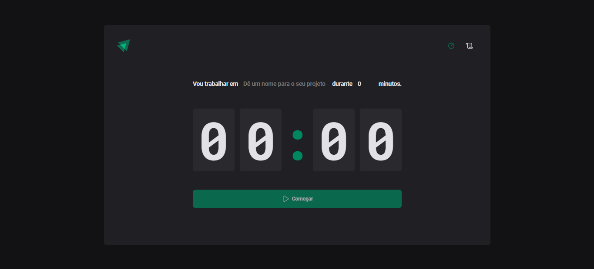
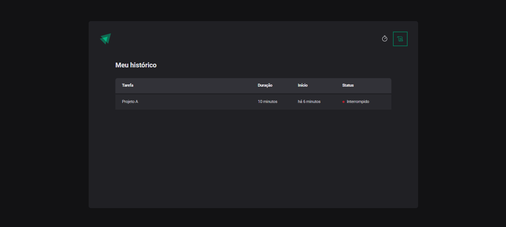

# ignite-timer
# About
Ignite timer was developed at Rocketseat's React.js course, it is a timer where you can set intervals between 5 and 60 minutes  for example, to study using Pomodoro method.
You can also access the history of past timers set and the status of them.
<p align="center">  </p> 
<p align="center">  </p> 

# Techs
- TypeScript
- React
- Vite
- Styled Components
- zod
- Immer

# Test
Clone this repo. and install all needed dependencies

```bash
npm install
```
Then run 
```bash
npm run dev
```
And enjoy!
